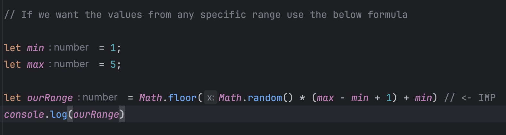

<h1 style="color:yellowgreen; border: solid; text-align: center">JavaScript_ChaiWithCode</h1>

<h4>Diff in console.log( ) & console.table( [ ] )</h4>

In console.log( ) we just able to print single variable,  
In console.table( [ ] ) we are able to print multiple variables in a table format

<h4>Stack & Heap Memory</h4> 
When we assign any primitive datatype it stores in -( Stack Memory )- 
and when we assign any Non-Primitive datatype it stores in -( Heap Memory )-

<h4>Math.random( ) IMP formula</h4>

<h4>IMP Math Functions</h4>
1. Math.PI( )  - returns the value of pie  
2. Math.round( ) - returns the rounded value  
3. Math.floor( ) - returns the Num without decimals  
4. Math.min( ) - returns the min value of an array  
5. Math.max( ) - return the max value of an array  

